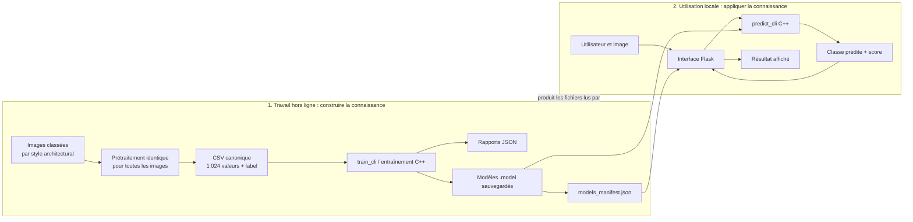
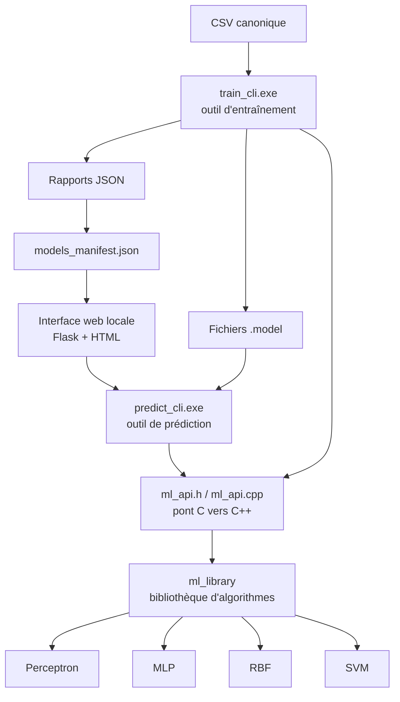
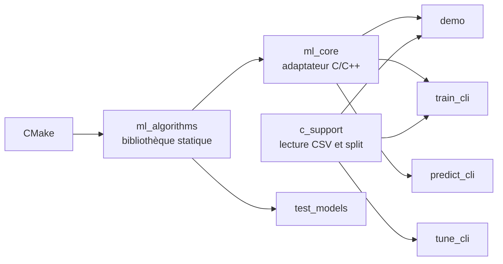

# 1 — Vue d'ensemble : la carte du projet

## Le problème résolu

Une image de façade ne peut pas être directement comprise par un algorithme.
Le projet convertit donc une image en une liste de nombres, puis demande à un
modèle appris sur des exemples de choisir une des trois classes :

| Identifiant | Classe |
|---:|---|
| 0 | Art déco |
| 1 | Art nouveau |
| 2 | Gothique |

Le système ne « reconnaît » pas une époque comme un humain. Il compare les
motifs numériques de l'image reçue avec ce qu'il a appris sur les images
d'entraînement.

## Les deux temps du projet

La séparation suivante est le point le plus important à savoir expliquer :

L'entraînement peut prendre du temps car le modèle ajuste ses paramètres sur
beaucoup d'exemples. La prédiction est beaucoup plus courte : elle utilise les
paramètres déjà calculés. C'est pourquoi Flask ne lance jamais `train_cli`.

## Les briques et leurs responsabilités

| Brique | Rôle simple | Ce qu'elle ne fait pas |
|---|---|---|
| `ml_library` | Contient l'implémentation des quatre algorithmes. | Elle ne crée ni page web ni CSV. |
| `ml_api` | Traduit les appels simples de l'application C vers les objets C++. | Elle ne réimplémente pas les algorithmes. |
| `train_cli` | Lit le CSV, sépare les données, entraîne, évalue et sauvegarde. | Il n'affiche pas de page web. |
| `predict_cli` | Charge un modèle existant et prédit pour 1 024 valeurs. | Il n'entraîne pas le modèle. |
| Flask | Reçoit les images, applique le prétraitement, appelle `predict_cli`, affiche le résultat. | Flask ne fait pas le calcul ML. |
| `models_manifest.json` | Décrit les modèles utilisables : nom, fichier, dimensions, score. | Ce n'est pas le modèle : il ne contient pas les poids. |

## Les applications disponibles

Toutes les applications sont compilées par CMake, mais elles n'ont pas le même
but. Les confondre est une erreur fréquente à l'oral.

| Application | À quoi elle sert | Quand l'utiliser |
|---|---|---|
| `demo.exe` | Démonstration console et cas pédagogiques. | Montrer les algorithmes et les cas simples. |
| `test_models` | Tests de la bibliothèque `ml_library`. | Vérifier les algorithmes isolés. |
| `train_cli.exe` | Entraînement non interactif et reproductible. | Générer un modèle et son rapport. |
| `tune_cli.exe` | Comparer un petit nombre de paramètres sur une validation interne. | Chercher une amélioration sans toucher au test final. |
| `predict_cli.exe` | Prédiction non interactive depuis un modèle sauvegardé. | Utilisé par l'interface web. |

## La compilation, sans entrer dans le code

Le compilateur est MinGW fourni avec CLion. Eigen est une bibliothèque d'en-têtes
utilisée pendant la compilation pour les vecteurs et matrices C++ ; les modèles
ne dépendent pas d'Eigen au moment où Flask lance une prédiction.

## Les trois messages essentiels à mémoriser

1. **Le modèle apprend hors ligne, puis il est sauvegardé.**
2. **Le prétraitement est le même pour le dataset et pour les images envoyées dans le navigateur.** Sans cela, le modèle recevrait des données différentes de celles sur lesquelles il a appris.
3. **L'interface web est une couche d'utilisation, pas une seconde implémentation du machine learning.** Les calculs de prédiction restent dans le C++.
