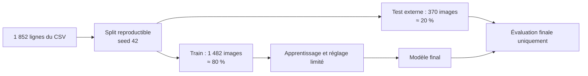
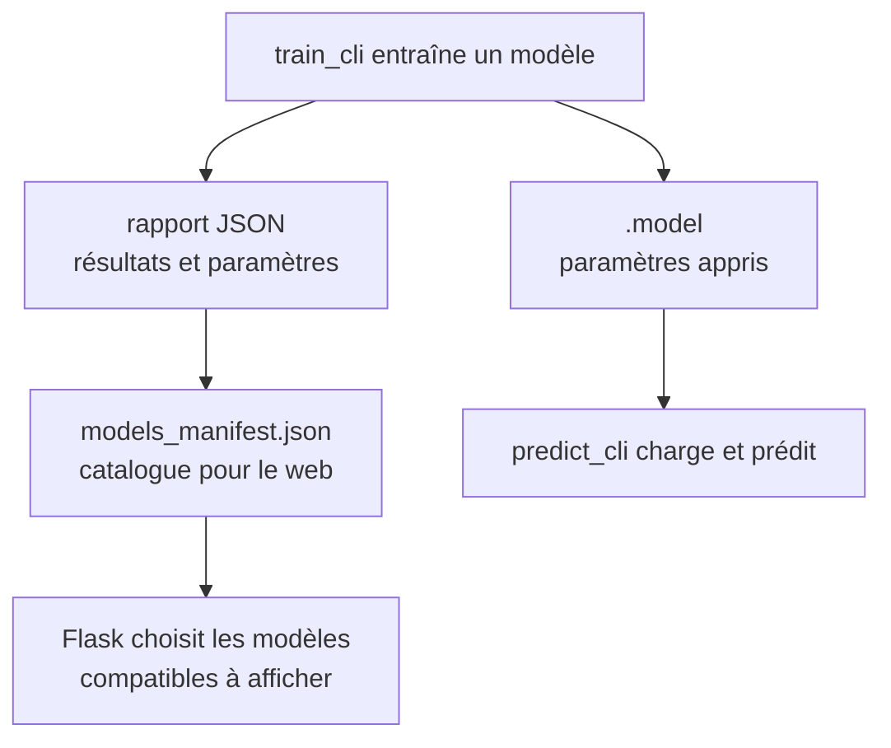

# 2 — Données, entraînement et modèles

## 1. La source des données

La source canonique locale est le dossier :

`projet_rendu_2_ml/data/Dataset final-20260702T055807Z-3-001/Dataset final sans doublon`

Il contient des images réparties dans les trois classes. Le dataset actuellement
utilisé compte **1 852 images** :

| Classe | Label | Nombre d'images |
|---|---:|---:|
| Art déco | 0 | 554 |
| Art nouveau | 1 | 745 |
| Gothique | 2 | 553 |
| **Total** | — | **1 852** |

Le dossier source n'est ni modifié ni copié par le pipeline. Le script le lit
dans un ordre stable, afin que deux générations sur les mêmes fichiers donnent
le même CSV.

## 2. Pourquoi transformer les images en CSV ?

Les algorithmes C++ reçoivent des nombres, pas un fichier PNG ou JPEG. Chaque
image suit exactement le même pipeline :

```mermaid
flowchart LR
    A[Image PNG / JPG / JPEG] --> B[Correction de l'orientation EXIF]
    B --> C[Niveaux de gris]
    C --> D[Redimensionnement<br/>32 × 32 pixels]
    D --> E[Valeurs de pixels converties<br/>en nombres réels]
    E --> F[Normalisation : pixel / 255]
    F --> G[Aplatissement ligne par ligne]
    G --> H[Vecteur de 1 024 valeurs<br/>entre 0 et 1]
    H --> I[Ajout du label<br/>dans le CSV d'entraînement]
```



Comme `32 × 32 = 1 024`, une ligne du CSV contient :

```text
feature_1, feature_2, ..., feature_1024, label
```

Le fichier `data/batiments_3_classes.csv` a donc **1 852 lignes** et
**1 025 colonnes**. Le label est la dernière colonne ; il n'est jamais donné au
modèle lorsqu'on lui demande une prédiction.

### Pourquoi la normalisation est indispensable ?

Avant normalisation, un pixel est un entier de 0 à 255. Après normalisation, il
est compris entre 0 et 1. Cela met toutes les caractéristiques à la même échelle
et rend l'entraînement plus stable. Il faut appliquer précisément cette même
conversion à une image envoyée sur le site, sinon le modèle travaillerait avec
une échelle qu'il n'a jamais vue.

## 3. Le split : apprendre sans tricher

Le CSV est séparé de manière reproductible avec une seed fixée à **42** :



Le jeu de test est volontairement écarté durant le choix des paramètres. Il sert
à obtenir une estimation plus honnête de la capacité du modèle à traiter des
images jamais vues. Quand des réglages sont comparés par `tune_cli`, une
validation interne est créée à l'intérieur du train ; le test externe reste
intact.

## 4. Les quatre algorithmes, avec une image mentale

| Algorithme | Idée à retenir | Force pédagogique | Limite observée sur ce dataset |
|---|---|---|---|
| Perceptron | Une frontière linéaire sépare les classes. | Le plus simple pour comprendre une classification. | Des styles visuels complexes ne sont pas toujours séparables par une simple frontière. |
| SVM linéaire | Cherche une frontière avec une marge entre les classes. | Introduit l'idée de marge et de perte hinge. | Reste linéaire ici. |
| MLP | Réseau avec une couche cachée : il apprend des transformations non linéaires. | Peut représenter des séparations plus complexes. | Plus lent à entraîner et sensible aux paramètres. |
| RBF | Compare une image à des centres représentatifs via des fonctions gaussiennes. | Montre une approche fondée sur la proximité. | Plus coûteux et ses paramètres sont sensibles en 1 024 dimensions. |

Les quatre modèles utilisent une logique **un-contre-tous** pour les trois
classes : chaque classe possède un score ; la classe dont le score est le plus
grand devient la prédiction finale.

## 5. Les modèles sélectionnés pour l'interface

Le fichier `models/models_manifest.json` est la source de vérité sur les modèles
proposés dans l'interface. À ce jour, il référence les versions suivantes :

| Algorithme | Version affichée | Accuracy test | Lecture raisonnable |
|---|---|---:|---|
| Perceptron | v1 | 52,16 % | Référence linéaire simple. |
| **MLP** | **v2** | **56,76 %** | Meilleur résultat global parmi les modèles retenus. |
| RBF | v2 | 51,89 % | Corrigée par rapport à la v1 dégénérée ; reste moins performante que le MLP. |
| SVM | v1 | 50,81 % | Autre référence linéaire. |

L'accuracy mesure la proportion totale de bonnes réponses sur les 370 images de
test. Ce n'est pas une promesse de réussite sur toute image du monde : les
résultats dépendent du dataset, de son volume, de ses prises de vue et de la
variabilité des styles.

### Le cas RBF, expliqué simplement

La RBF v1 prédisait Gothique pour tous les exemples de test. C'était un signe
de dégénérescence, pas un comportement acceptable. En 1 024 dimensions, une
valeur de sigma trop faible rend les activations gaussiennes presque nulles ; le
biais peut alors dominer. La version v2 utilise un choix de centres réparti et
des paramètres adaptés (96 centres, sigma 5), ce qui produit des trois classes
au lieu d'une seule. Elle est conservée séparément de v1 pour garder une trace
de la comparaison.

## 6. Sauvegarde, rapport et manifest : trois fichiers différents



| Fichier | Contenu | Utilisé pendant la prédiction ? |
|---|---|---|
| `*.model` | Paramètres appris : poids, biais, dimensions et paramètres propres au modèle. | Oui, chargé par `predict_cli`. |
| `reports/*.json` | Accuracy, matrice de confusion, durée, paramètres et vérification du rechargement. | Non, ce sont des preuves d'entraînement. |
| `models_manifest.json` | Nom lisible, fichier associé, dimensions attendues, type de score et résultats résumés. | Oui, lu par Flask pour proposer les modèles existants. |

## 7. Ne pas confondre score et confiance

L'interface montre un score, mais il faut employer les mots justes devant le
jury :

| Modèles | Sens du score | À ne pas dire |
|---|---|---|
| Perceptron, SVM | Une **marge** : distance ou force relative par rapport à la frontière. | « 0,8 signifie 80 % de certitude. » |
| MLP, RBF | La meilleure valeur de probabilité un-contre-tous calculée par le modèle. | « Les scores de deux algorithmes sont directement comparables. » |

Les scores ne sont comparables qu'entre prédictions du **même modèle**. Pour
choisir un modèle, on regarde plutôt les métriques d'évaluation, notamment
l'accuracy et la matrice de confusion.

## Réponse courte possible à l'oral

> Nous avons créé un CSV reproductible à partir du dataset local. Chaque image
> devient 1 024 pixels en niveaux de gris normalisés. Avec un split fixe 80/20,
> les modèles apprennent sur 1 482 images et sont évalués sur 370 images jamais
> vues. Le MLP v2 est celui que nous présentons en priorité, car il obtient la
> meilleure accuracy test parmi les modèles retenus.
