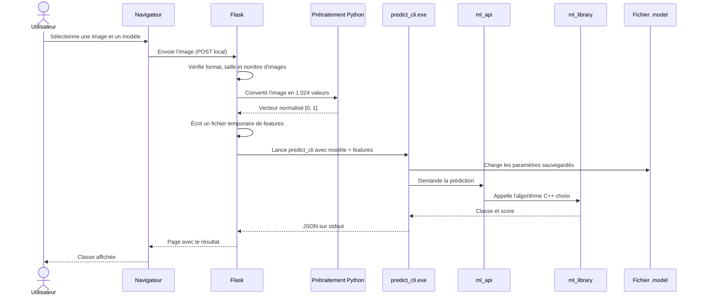
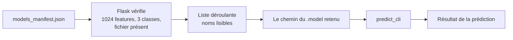

# 3 — Prédiction et applications : qui appelle quoi ?

## Le trajet exact d'une image dans l'interface web



La chaîne essentielle est donc :

```text
Flask → fichier temporaire de 1 024 valeurs → predict_cli.exe
      → ml_load → ml_predict / ml_predict_with_score → JSON → navigateur
```

Flask crée les fichiers de valeurs dans un dossier temporaire et les supprime à
la fin de la requête. Les erreurs de l'exécutable C++ vont sur la sortie
d'erreur ; sa sortie standard est réservée au JSON de résultat, ce qui rend le
dialogue fiable.

## Ce que Flask contrôle avant la prédiction

| Contrôle | Pourquoi |
|---|---|
| PNG, JPG ou JPEG seulement | Éviter de traiter un format qui n'est pas prévu. |
| Maximum 10 images par requête | Garder une utilisation locale raisonnable. |
| Maximum 10 Mo par image | Limiter les uploads trop lourds. |
| Nom de fichier sécurisé | Éviter qu'un nom utilisateur devienne un chemin dangereux. |
| Modèle présent dans le manifest et sur disque | Ne proposer que les choix réellement utilisables. |
| 1 024 valeurs après prétraitement | Correspondre exactement à l'entrée des modèles 32 × 32. |
| Nombre de classes attendu : 3 | Éviter d'afficher un résultat provenant d'un modèle incompatible. |

Pillow sert uniquement à ouvrir l'image et à appliquer le prétraitement. Il ne
fait aucun apprentissage ni aucune prédiction machine learning.

## Le rôle de `predict_cli`

`predict_cli.exe` est le contrat entre l'interface Python et le cœur C++. Il
reçoit un chemin de modèle et un fichier de caractéristiques. Il vérifie les
dimensions, charge le modèle, demande la prédiction, puis retourne un JSON du
type suivant :

```json
{
  "class_id": 1,
  "class_name": "Art nouveau",
  "score": 0.0,
  "score_type": "best_ovr_probability",
  "class_count": 3
}
```

La valeur numérique exacte du score dépend du modèle. Le résultat utile pour
l'utilisateur est d'abord `class_name` ; le score est un indicateur technique
à interpréter dans le contexte de l'algorithme choisi.

## Le manifest : un catalogue, pas un calculateur



Le manifest contient par exemple le nom affiché, le fichier `.model`, le type
d'algorithme, les dimensions attendues et les métriques enregistrées. En
revanche, les poids nécessaires à une prédiction restent dans le fichier
`.model`. Cette séparation rend l'interface plus simple : elle sait quels
modèles proposer sans avoir à comprendre leur format interne.

## Les applications de démonstration à ne pas mélanger

### A. Interface web : le chemin normal à montrer

```text
Navigateur → Flask → predict_cli → modèle sauvegardé → résultat
```

Elle est pratique pour montrer le projet à une personne non technique. Elle ne
fait pas d'entraînement.

### B. Démonstration console : `demo.exe`

```text
Utilisateur terminal → demo.exe → ml_api → ml_library → affichage console
```

Elle sert à illustrer les cas de test et les algorithmes dans le terminal.
Elle est indépendante de Flask.

## Pourquoi conserver une API C devant des algorithmes C++ ?

L'application historique contient des exécutables en C, alors que les modèles
sont écrits en C++ avec Eigen. `ml_api.h` fournit une frontière simple : les
programmes C manipulent un modèle via des fonctions telles que créer, entraîner,
sauvegarder, charger et prédire. `ml_api.cpp` transforme ensuite ces demandes
en appels vers Perceptron, MLP, RBF ou SVM.

Cette organisation permet de conserver une seule implémentation de chaque
algorithme : celle de `ml_library`.

## Commandes utiles pour une démonstration locale

Les commandes sont à lancer depuis
`notebook_modeles_entraines_batiments_clean/app_final/projet_rendu_2_ml` après
compilation avec la toolchain de CLion.

```powershell
# Lancer l'interface web locale
python .\web\app.py

# Ouvrir dans le navigateur
# http://127.0.0.1:5000
```

```powershell
# Lancer une prédiction sans navigateur (features.txt contient 1 024 valeurs)
..\..\..\cmake-build-debug\predict_cli.exe `
  .\models\buildings_3classes_32x32_mlp_v2.model `
  .\features.txt `
  --expected-class-count 3
```

Pour une soutenance, privilégier le MLP v2 dans l'interface : c'est le meilleur
modèle du manifest sur l'accuracy test actuelle. Indiquer honnêtement que les
autres modèles restent disponibles pour comparaison pédagogique.
