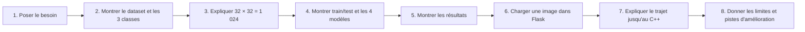

# 4 — Préparer la soutenance

## Présentation en une minute

> Notre projet classe des images de bâtiments en trois styles : Art déco, Art
> nouveau et Gothique. Nous partons d'un dataset local sans doublons. Chaque
> image est redressée, convertie en niveaux de gris, redimensionnée en 32 par
> 32 puis normalisée. Elle devient donc un vecteur de 1 024 valeurs. Nous
> entraînons en C++ quatre algorithmes : Perceptron, MLP, RBF et SVM. Les modèles
> entraînés sont sauvegardés avec leurs rapports et référencés par un manifest.
> Ensuite, Flask sert uniquement d'interface locale : il applique le même
> prétraitement à l'image chargée et demande la prédiction à `predict_cli`, qui
> utilise le vrai code C++. Le meilleur modèle retenu est actuellement le MLP
> v2 avec 56,76 % d'accuracy sur le jeu de test externe.

## Déroulé conseillé d'une démonstration

Ne commence pas par les classes C++ ou les formules. Commence par le besoin,
puis les données, puis l'utilisation visible. Le jury comprendra ensuite
pourquoi les composants techniques existent.

## Les questions probables et des réponses honnêtes

### « Pourquoi 1 024 caractéristiques ? »

Parce que chaque image est réduite à 32 × 32 pixels en niveaux de gris. Un pixel
correspond à une valeur, donc 32 × 32 = 1 024. Cette taille garde un coût de
calcul raisonnable tout en conservant une partie de la structure visuelle.

### « Pourquoi le même prétraitement pour le dataset et le site ? »

Un modèle apprend à partir d'une représentation précise. Si l'entraînement
utilise des images 32 × 32 en gris normalisé et que le site envoie autre chose,
les valeurs n'ont plus le même sens. C'est une incohérence de données qui peut
dégrader fortement les prédictions.

### « Pourquoi Flask si le projet est en C++ ? »

Flask facilite l'upload d'images et l'affichage dans un navigateur. Il ne
contient pas d'algorithme ML : il appelle `predict_cli.exe`, qui charge et
exécute les modèles C++. Python est donc une interface, pas le moteur ML.

### « Pourquoi sauvegarder les modèles ? »

L'entraînement est plus long et il dépend du dataset. Une fois le modèle
entraîné et évalué, nous sauvegardons ses paramètres. L'application peut alors
prédire immédiatement sans refaire l'apprentissage et avec la même version du
modèle.

### « Pourquoi un manifest en plus des modèles ? »

Un modèle contient les paramètres numériques. Le manifest est un catalogue
lisible qui associe un nom, un fichier, les dimensions attendues et le type de
score. Il évite de coder en dur la liste des modèles dans Flask.

### « Comment évitez-vous la fuite entre train et test ? »

Le split externe avec seed 42 est créé avant l'entraînement. Les paramètres sont
comparés sur une validation interne issue du train. Le test externe de 370
images est réservé à l'évaluation finale du modèle retenu.

### « Pourquoi le MLP est-il présenté en priorité ? »

Parmi les modèles référencés, il obtient la meilleure accuracy test actuelle,
56,76 %. C'est donc un choix basé sur une évaluation mesurée, et non sur le nom
de l'algorithme.

### « Le score affiché est-il une confiance ? »

Non, pas de manière générale. Pour Perceptron et SVM, c'est une marge. Pour MLP
et RBF, c'est la meilleure valeur one-vs-rest. Ces valeurs se lisent seulement
à l'intérieur d'un même modèle et ne remplacent pas les métriques d'évaluation.

### « Qu'avez-vous corrigé sur la RBF ? »

La première RBF prédisait toujours Gothique, ce qui montrait un effondrement du
modèle. Nous avons étudié les activations, choisi des centres de façon répartie
et testé quelques valeurs de sigma et de centres. La v2 prédit désormais les
trois classes et améliore l'accuracy de test, tout en conservant la v1 pour la
traçabilité.

### « Quelles bibliothèques externes utilisez-vous ? »

Le calcul matriciel C++ utilise Eigen. Python utilise Flask pour l'interface et
Pillow pour ouvrir et transformer les images. Aucun calcul ML n'est délégué à
une bibliothèque Python ou à un framework tel que TensorFlow, PyTorch ou
scikit-learn.

## Ce qu'il faut dire avec prudence

| À dire | À éviter |
|---|---|
| « Le MLP v2 atteint 56,76 % sur notre jeu de test local de 370 images. » | « Le modèle reconnaît parfaitement tous les styles architecturaux. » |
| « Les classes sont prédéfinies dans notre dataset. » | « Le système découvre seul les styles. » |
| « Le score dépend de l'algorithme. » | « Le score est toujours une probabilité de confiance. » |
| « La RBF v2 corrige la prédiction d'une classe unique. » | « La RBF est désormais le meilleur modèle. » |
| « L'interface utilise un modèle déjà entraîné. » | « Le site apprend pendant l'upload. » |

## Limites assumées et pistes d'amélioration

| Limite actuelle | Pourquoi elle existe | Piste raisonnable |
|---|---|---|
| Accuracy modérée | Les styles peuvent se ressembler et le dataset reste limité. | Plus de données variées et mieux annotées. |
| Image réduite à 32 × 32 en gris | Choix simple et léger pour un projet pédagogique. | Tester une résolution ou des descripteurs adaptés, avec protocole identique. |
| Classes quelque peu déséquilibrées | Art nouveau est plus représenté. | Équilibrage, collecte ciblée et métriques par classe. |
| Score non comparable entre algorithmes | Les modèles ne calculent pas le même type de valeur. | Calibration étudiée séparément si nécessaire. |
| Interface locale | Objectif de démonstration et de sécurité simple. | Ajouter une vraie couche de déploiement seulement si le besoin le justifie. |

## Checklist juste avant le jury

- Le build CMake de CLion contient au moins `predict_cli` et `train_cli`.
- `models/models_manifest.json` et les quatre modèles qu'il référence sont présents.
- L'environnement Python contient Flask et Pillow.
- `python .\web\app.py` ouvre bien `http://127.0.0.1:5000`.
- Prévoir une image valide PNG/JPG/JPEG et sélectionner **MLP — bâtiments 3 classes**.
- Avoir les chiffres en tête : 1 852 images, 3 classes, 1 024 features, split 1 482 / 370, seed 42, MLP v2 à 56,76 %.
- Prévoir de dire une limite avant que le jury ne la soulève.

## Si l'on te demande de montrer le code ensuite

Lis les composants dans cet ordre, pas l'inverse :

1. `web/app.py` et `web/image_processing.py` pour voir l'interface et le prétraitement.
2. `src/predict_cli.cpp` et `include/ml_api.h` pour comprendre le contrat de prédiction.
3. `src/ml_api.cpp` pour observer le pont C/C++.
4. `ml_library/include` puis `ml_library/src` pour le détail des algorithmes.
5. `src/train_cli.cpp` et `src/tune_cli.cpp` pour l'entraînement et la comparaison de paramètres.
